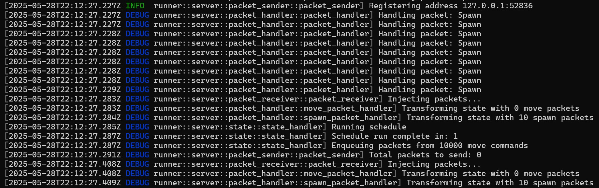

# Fordragon

### Currently under heavy refactoring

A naive implementation of an MMO backend and its tooling eco-system.

## Components

_Being added based on where development is currently_

#### Runner
The Runner is the heart of the Fordragon MMO backend architecture. It is responsible for initializing the core server components and orchestrating the server’s main event loop. It uses a configurable tick-based scheduler, and wires together the packet sender and receiver subsystems. It manages the lifecycle of the server, ensuring that all systems are properly initialized and ran in the correct order.

Uses bevy_ecs to manage game state and systems efficiently, enabling scalable and modular gameplay logic. For network communication, it utilizes a UdpSocket to send and receive packets between the server and connected clients, supporting real-time multiplayer interactions.

#### Mock Client
The Mock Client is a crude testing utility designed to simulate a game client for the Fordragon MMO backend. The mock client establishes a UDP connection to the server and periodically sends batches of (for now only) spawn packets.

## Current TODO:
 - [ ] Separate SEND and RECV protocol as packets will differ.
 - [ ] Command containers should implement a trait that can be easily stored and iterated through.
 - [ ] Code organisation for commonly used items should be cleaned up
 - [ ] Interpolation of networked entities (client feature TBD)
 - [ ] Prediction of local player (client feature TBD)
 - [ ] Authorization of owned entities
 - [ ] Switch to QUIC
 - [ ] Stateful actions (MOVE_FORWARD_START, MOVE_FORWARD_STOP ect. instead of consuming data from clients)

 ####

 This is a crude implementation used for research purposes. For bevy related networking, it's best to refer to the [lightyear plugin](https://github.com/cBournhonesque/lightyear)